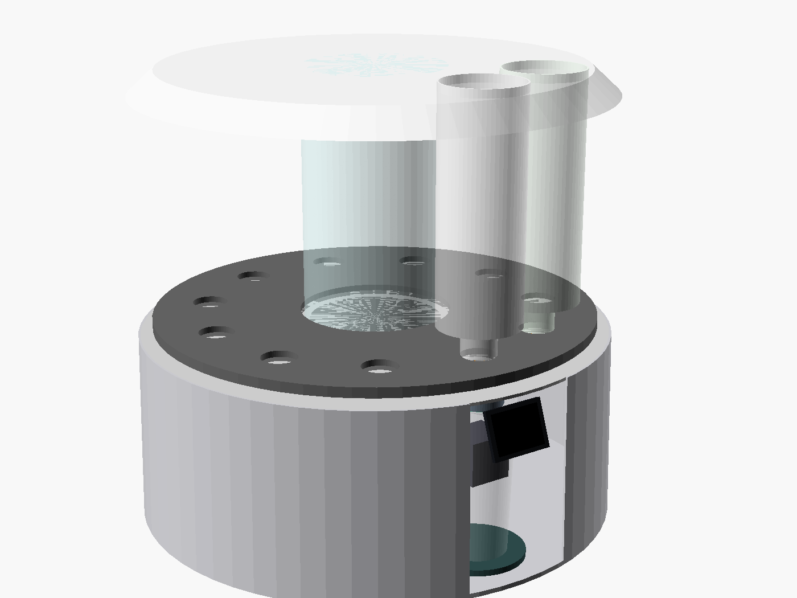
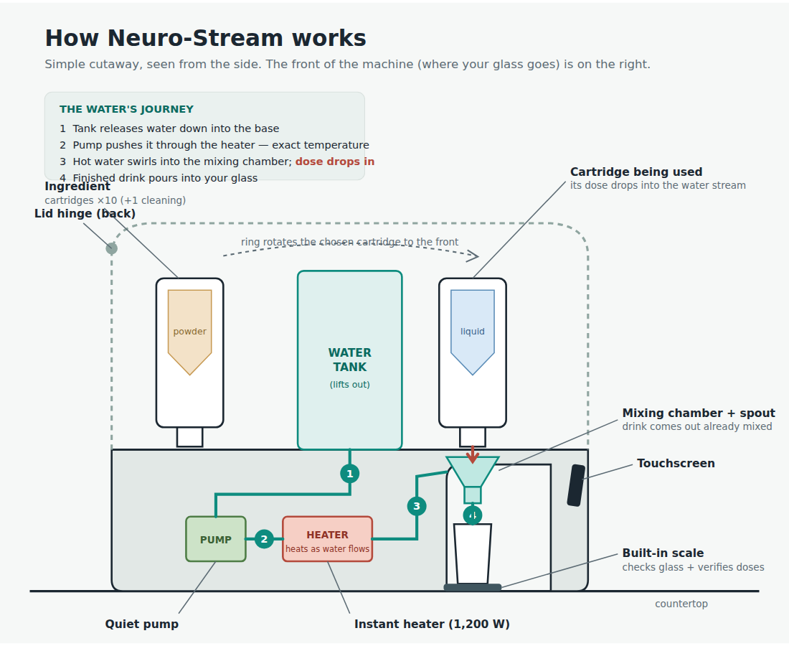

# Neuro-Stream

**One machine. Ten ingredients. Every drink exact.**

Neuro-Stream is a countertop smart-cartridge dispenser for functional powders
and liquid formulas. It builds a personalized drink in about a minute: it
meters up to **4 ingredients per serving to ±2%** accuracy, dissolves them
in-line in water heated to **±2 °F**, and cleans itself overnight.

**Engineering program: complete — all 6 phases founder-signed (2026-07-10),
plus a buildable MVP pack (wiring, plumbing, part list, build order).**

## How it works, in one paragraph

Eleven 1-liter smart cartridges (10 ingredients + 1 self-cleaning cartridge)
sit on a rotating carousel around a central removable ~3.5 L water tank. Each
cartridge contains its own factory-calibrated metering mechanism — a dosing
screw for powders, a piston pump for liquids in sterile no-preservative
bags — driven by a single shared motor through a standard docking interface.
Doses drop into a swirling stream of precisely heated water (a venturi
manifold with an off-center water inlet that spins the flow) and dissolve
in-line on the way to the glass. A built-in scale verifies every dose, an NFC
reader identifies each cartridge and loads its calibration, and an ESP32-S3
runs the touchscreen, app, auto-reorder, and wearable-driven recipe
suggestions — all fully usable with no phone present.

## Key specs

| Spec | Value |
|---|---|
| Cartridge slots | 11 (10 ingredients + 1 cleaning) |
| Ingredients per drink | up to 4 |
| Dose accuracy | ±2% (scale-verified) |
| Water temperature | ±2 °F, per-recipe setpoint |
| Water tank | ~3.5 L, removable |
| Footprint | Ø 47 cm countertop |
| Controller | ESP32-S3, offline-first; app/NFC/wearables optional |
| Target retail | $499–549 at 5,000-unit production |

## Repository map

### Engineering documents (read in order)

| # | File | Contents |
|---|---|---|
| 1 | [docs/phase1-concept-and-mechanisms.md](docs/phase1-concept-and-mechanisms.md) | Mechanism trade study, dose envelope, architecture decision |
| 2 | [docs/phase2-cad.md](docs/phase2-cad.md) | Parametric CAD guide, tolerances, water/heating amendment |
| 3 | [docs/phase3-electronics-firmware.md](docs/phase3-electronics-firmware.md) | MCU, firmware design, thermal control, connected-product spec |
| 4 | [docs/phase4-materials-food-safety.md](docs/phase4-materials-food-safety.md) | FDA food-contact materials, certifications, self-cleaning model |
| 5 | [docs/phase5-manufacturing-dfm.md](docs/phase5-manufacturing-dfm.md) | DFM, tooling, costs from MVP ($55–105k) to 10k units ($139/unit) |
| 6 | [docs/phase6-validation-testing.md](docs/phase6-validation-testing.md) | Dosing/stability test protocols, certification checklist, stage gates |
| — | [docs/design-metering-venturi.md](docs/design-metering-venturi.md) | Deep dive: cartridge metering internals and wet-wall swirl manifold, with bench test plan |
| — | [docs/mvp-build-spec.md](docs/mvp-build-spec.md) | **Buildable MVP**: shopping list (~$700 electronics + ~$450 printed parts), ESP32 pin map, 4-stage build order, pass/fail tests |

### CAD (OpenSCAD, fully parametric)

| File | Contents |
|---|---|
| [cad/neuro-stream.scad](cad/neuro-stream.scad) | Complete machine: carousel, tank, base, hinged lid, touchscreen. `explode`, `cross_section`, `lid_open`, and `show_*` flags control views |
| [cad/cartridge-metering.scad](cad/cartridge-metering.scad) | Powder cartridge (hopper, sweeper, dosing screw, duckbill seal) and liquid cartridge (leadscrew piston, one-way valves) |
| [cad/venturi-manifold.scad](cad/venturi-manifold.scad) | Swirl mixing cone / venturi manifold |

Every dimension is a named variable. Renders of all views are in
[cad/renders/](cad/renders/).

### Schematics & diagrams

| File | Contents |
|---|---|
| [docs/diagrams/mvp-wiring.png](docs/diagrams/mvp-wiring.png) | Every wire and ESP32 pin, color-coded by voltage zone, with the full safety chain (GFCI → thermal fuses → relay → hardware watchdog) |
| [docs/diagrams/mvp-plumbing.png](docs/diagrams/mvp-plumbing.png) | Tank → check valve → pump → flow meter → heater → swirl cone, with tube lengths and fittings |
| [docs/diagrams/how-it-works.png](docs/diagrams/how-it-works.png) | Plain-language cutaway of the whole machine |

SVG sources sit next to each PNG.

## The MVP (start here to build)

The MVP in [docs/mvp-build-spec.md](docs/mvp-build-spec.md) is deliberately
**one dispense station with hand-swapped cartridges** — the rotating 11-slot
ring is proven engineering that would only add prototype cost without
reducing risk. The build proves the four claims nobody can prove on paper,
in risk order:

1. **Dry powder dosing** — no water, no mains; proves ±2% by itself
2. **Cold water + swirl cone** — proves in-line dissolution
3. **Smart tags** — NFC cartridge identity and calibration
4. **Heat, last** — only after the full safety chain is wired

Three of the four stages need no mains wiring at all. Every dispense logs a
CSV row; those logs are the evidence file for the beta gate and investors.

## Approved commercialization path

**MVP ($55–105k) → 150-unit beta (~$220k) → 1,000–1,500 soft-mold run →
steel tooling + 5,000-unit production (~$499–549 retail).**
